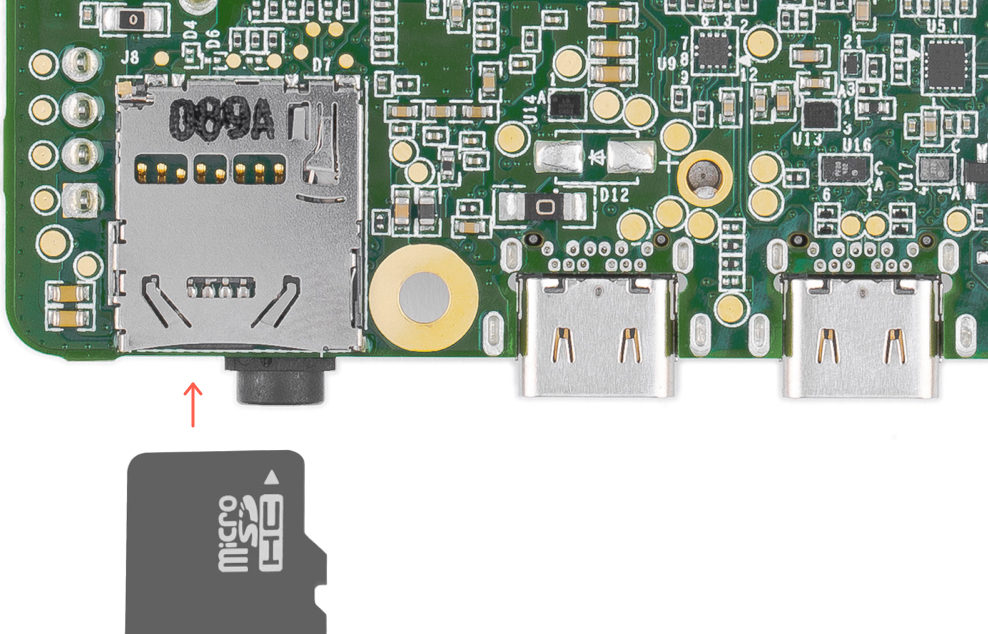
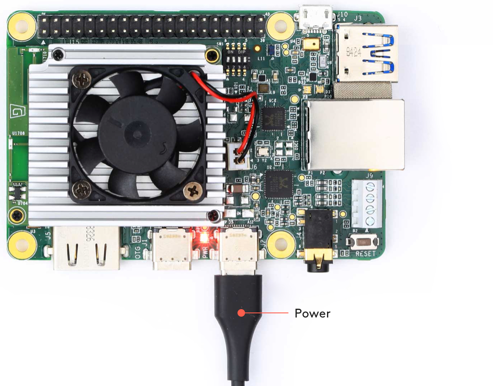
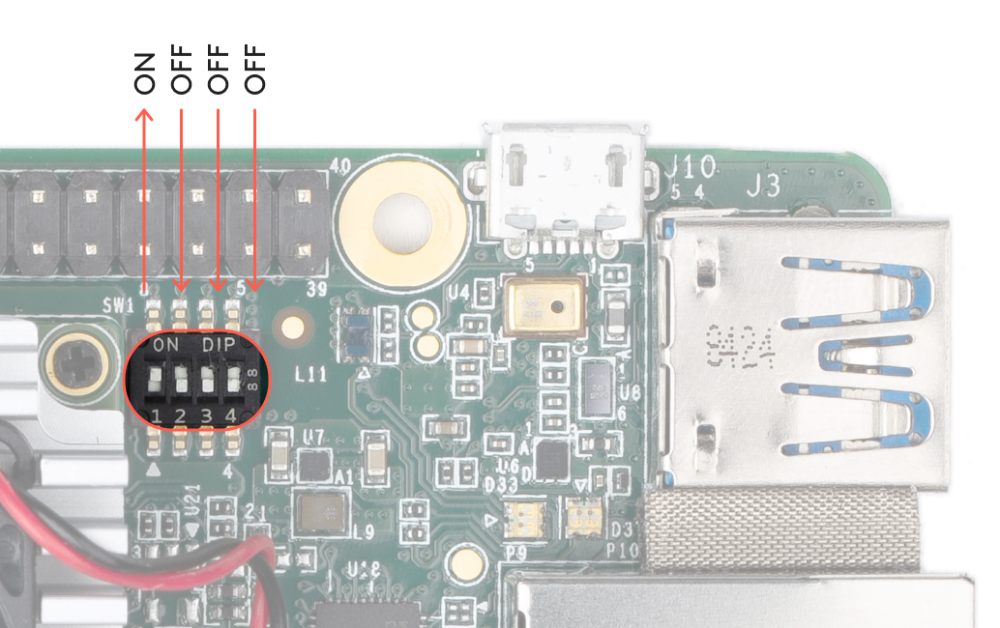
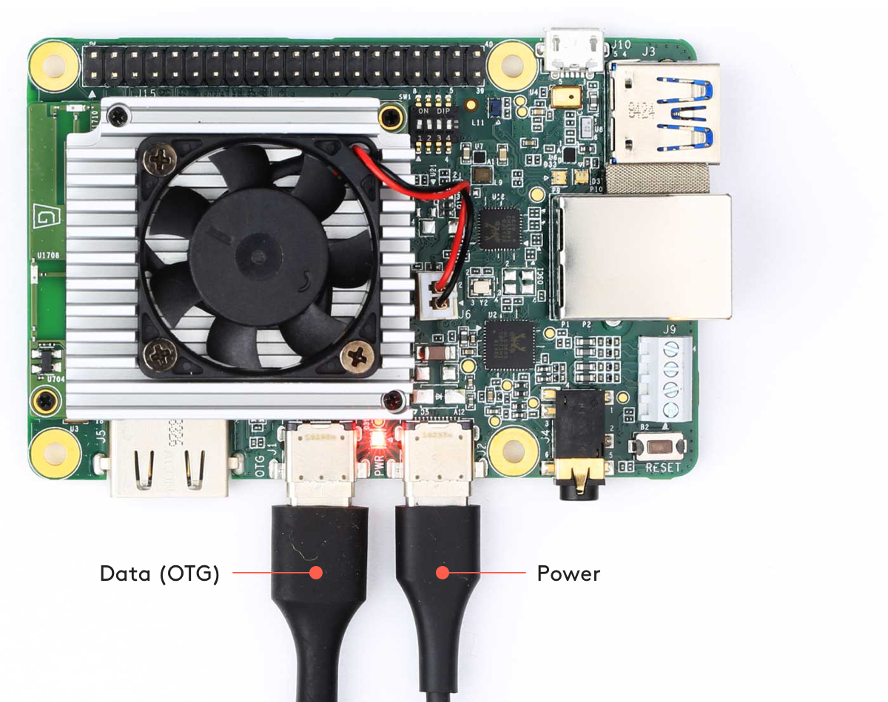

# Welcome on my git for the module of IA

if you want try, train and test yolov5 you have the tutorial of ultralitics [here](./yolov5/tutorial.ipynb)

On this file you can [initalizing](#first-step-you-need-to-get-started-with-the-google-coral-dev-board) the coral dev board

After init board you can run PyCoral API [here](#pycoral-api)

For train model and view result go [here](yolov5/Train.ipynb)

For deploy personalised recognition in Coral dev board [here](#Deploy-service)

## First step you need to get started with the google coral dev board

### 1 Gather requirements

***Note: Do not power the board or connect any cables until instructed to do so.***

Before you begin, collect the following hardware:


<ul>
    <li>
        <label>
            <input type="checkbox" checked> 
            A host computer running Linux (recommended), Mac, or Windows 10
        </label>
    </li>
    <ul>
        <li>
            <label>
                <input type="checkbox" checked>
                Python 3 installed
            </label>
        </li>
    </ul>
    <li>
        <label>
            <input type="checkbox" checked>
            One microSD card with at least 8 GB capacity, and an adapter to connect it to your host computer
        </label>
    </li>
    <li>
        <label>
            <input type="checkbox"  checked>
            One USB-C power supply (2-3 A / 5 V), such as a phone charger
        </label>
    </li>
    <li>
        <label>
            <input type="checkbox" checked>
            One USB-C to USB-A cable (to connect to your computer)
        </label>
    </li>
    <li>
        <label>
            <input type="checkbox" checked>
            An available Wi-Fi connection (or Ethernet cable)
        </label>
    </li>
</ul>

***Note: Although you can connect a keyboard and monitor to the board, we do not recommend it because the system is not designed to operate as a desktop environment and doing so can affect the system performance. So our documentation emphasizes use of a terminal when interacting with the Dev Board (either with the serial console or SSH).***

### 2. Flash the board

1. Download and unzip the SD card image: enterprise-eagle-flashcard-20211117215217.zip

    The ZIP contains one file named flashcard_arm64.img.

2. Use a program such as balenaEtcher to flash the flashcard_arm64.img file to your microSD card.

    This takes 5-10 minutes, depending on the speed of your microSD card and adapter.

3. While the card is being flashed, make sure your Dev Board is completely unplugged, and change the boot mode switches to boot from SD card, as shown in figure 1.

Boot mode | Switch 1 | Switch 2 | Switch 3 | Switch 4 
 --- | --- | --- | --- | ---
SD card | ON | OFF | ON | ON


**Figure 1.** Boot switches set to SD card mode


4. Once the card is flashed, safely remove it from your computer and insert it into the Dev Board (the card's pins face toward the board). The board should not be powered on yet.



**Figure 2.** The microSD card slot is on the bottom

5. Optional: If you'd like to see the bootloader logs while the board is being flashed, either connect a monitor to the board's HDMI port or connect to the board's serial console. Nothing will appear until you power the board in the next step.

6. Power up the board by connecting your 2-3 A power cable to the USB-C port labeled "PWR" (see figure 3). The board's red LED should turn on.

    ***Caution: Do not attempt to power the board by connecting it to your computer.
When the board boots up, it loads the SD card image and begins flashing the board's eMMC memory.***

    It should finish in 5-10 minutes, depending on the speed of your microSD card.

    You'll know it's done when the board shuts down and the red LED turns off.



**Figure 3.** A USB-C power cable connected to the board

7. When the red LED turns off, unplug the power and remove the microSD card.

8. Change the boot mode switches to eMMC mode, as shown in figure 4:


Boot mode | Switch 1 | Switch 2 | Switch 3 | Switch 4 
 --- | --- | --- | --- | ---
SD card | ON | OFF | OFF | OFF



**Figure 4.** Boot switches set to eMMC mode

9. Connect the board to power and it should now boot up Mendel Linux.

    Booting up for the first time after flashing takes about 3 minutes (subsequent boot times are much faster).


### 3. Install MDT
While the board boots up, you can install MDT on your host computer.

MDT is a command line tool that helps you interact with the Dev Board. For example, MDT can list connected devices, install Debian packages on the board, and open a shell terminal on the board.

You can install MDT on your host computer follows:

``` bash
python3 -m pip install --user mendel-development-tool
```


You might see a warning that mdt was installed somewhere that's not in your PATH environment variable. If so, be sure you add the given location to your PATH, as appropriate for your operating system. If you're on Linux, you can add it like this:

``` bash
echo 'export PATH="$PATH:$HOME/.local/bin"' >> ~/.bash_profile
```

source ~/.bash_profile
Windows users: If you're using Git Bash, you'll need an alias to run MDT. Run this in your Git Bash terminal:

``` bash
echo "alias mdt='winpty mdt'" >> ~/.bash_profile

source ~/.bash_profile
```

### 4. Connect to the board's shell via MDT
Now that you have the Mendel system on the board, you can initiate a secure shell session using the MDT tool. Using MDT is just an easy way to generate an OpenSSH public/private key pair, push the public key onto the board, and then establish an SSH connection. (You should have already installed MDT on your host computer, as per the above requirements.)

First, connect a USB-C cable from your computer to the board's other USB port (labeled "OTG").



**Figure 5.** The USB data and power cables connected


Now make sure MDT can see your device by running this command from your host computer:

``` bash
mdt devices
```

You should see output showing your board hostname and IP address:

``` bash
orange-horse        (192.168.100.2)
```

If you don't see your device printed, it's probably because the system is still setting up Mendel. So instead run mdt wait-for-device. When your board is ready, it will print "Found 1 devices."


***Note: Your board's hostname is randomly generated the first time it boots from a new flashing. We do this to ensure that each device within a local fleet is likely to have a unique name. Of course, you can change this name using standard Linux hostname tooling (such as hostname).***

Now to open the device shell, run this command:

``` bash
mdt shell
```

After a moment, you should see the board's shell prompt.

***Note: You must connect to the board via MDT over USB at least once before you can SSH via any other method. Using USB allows MDT to generate an SSH public/private key pair and push it to the board's authorized_keys file, which then allows you to authenticate with SSH. (Using MDT is just easier than manually copying the key over the serial console.)***


For more information about what you can do with MDT, read about the [Mendel Development Tool](https://coral.ai/docs/dev-board/mdt/).

### 5. Connect to the internet

You'll need the board online to download system updates, models, and samples.

Either connect an Ethernet cable to the board or select a Wi-Fi network by running the following command in the device shell:

```bash
nmtui
```

Then select <ins>*Activate a connection*</ins> and select a network from the list under <ins>*Wi-Fi (wlan0)*</ins>.

Alternatively, use the following command to connect to a known network name:

``` bash
nmcli dev wifi connect <NETWORK_NAME> password <PASSWORD> ifname wlan0
```

Verify your connection with this command:

``` bash
nmcli connection show
```

You should see your selected network listed in the output. For example:

``` bash
NAME                UUID                                  TYPE             DEVICE
MyNetworkName       61f5d6b2-5f52-4256-83ae-7f148546575a  802-11-wireless  wlan0
```

The DEVICE name is wlan0 for a Wi-Fi connection or eth0 for an Ethernet connection.

### 6. Update the Mendel software

Some of our software updates are delivered with Debian packages separate from the system image, so make sure you have the latest software by running the following commands.

``` bash
sudo apt-get update

sudo apt-get dist-upgrade
```
Now you're ready to run a TensorFlow Lite model on the Edge TPU!


## PyCoral API

The demo above is rather complicated, so we've created some simple examples that demonstrate how to perform an inference on the Edge TPU using the TensorFlow Lite API (assisted by the PyCoral API).

Execute the following commands from the Dev Board shell to run our image classification example:

1. Download the example code from GitHub:


    ``` bash
    mkdir coral && cd coral

    git clone https://github.com/google-coral/pycoral.git

    cd pycoral
    ```

2. Download the model, labels, and bird photo:

    ``` bash
    bash examples/install_requirements.sh 
    ```

3. Run the image classifier with the bird photo (shown in figure 6):

    ```bash
    python3 examples/classify_image.py \
    --model test_data/mobilenet_v2_1.0_224_inat_bird_quant_edgetpu.tflite \
    --labels test_data/inat_bird_labels.txt \
    --input test_data/parrot.jpg
    ```


**Figure 6.** parrot.jpg

You should see results like this:

```bash
----INFERENCE TIME----
Note: The first inference on Edge TPU is slow because it includes loading the model into Edge TPU memory.
13.1ms
2.7ms
3.1ms
3.2ms
3.1ms
-------RESULTS--------
Ara macao (Scarlet Macaw): 0.75781
```

Congrats! You just performed an inference on the Edge TPU using TensorFlow Lite.


## Deploy service
